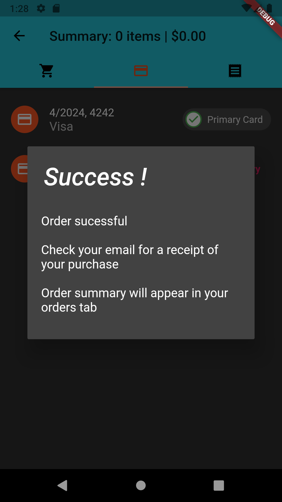

# flutter_ecommerce

Full-Stack E-Ticaret Mobil Uygulaması

Bu proje, yetkilendirilmiş kullanıcılar için tam bir alışveriş sepeti olan bir full-stack e-ticaret mobil uygulamasıdır.

Özellikler
Flutter Material Kütüphanesi kullanılarak göz alıcı bir kullanıcı arayüzüne sahip tamamlanmış bir uygulama.
Redux ile global durum yönetimi.
Redux Thunk ile asenkron işlemler.
Strapi yardımıyla özel kontrolcülere sahip tamamlanmış bir API.
Veritabanı olarak SQLite kullanılıyor.
Kullanıcı Kayıt / Giriş ile kullanıcı kimlik doğrulama.
Başlarken
Bu talimatlar, projeyi yerel makinenizde çalıştırmak veya geliştirmek için size yardımcı olacaktır.

Gereksinimler
Bu projenin çalışması için aşağıdaki yazılımlara ihtiyacınız vardır:

Flutter SDK (2.0.0 veya daha yeni sürümü)
Dart (2.12.0 veya daha yeni sürümü)
Strapi (4.0.0 veya daha yeni sürümü)
SQLite (3.0 veya daha yeni sürümü)

Kullanım
Uygulama çalıştığında, yetkilendirilmiş kullanıcılar için tam bir alışveriş sepeti sunar. Kullanıcılar, ürünleri keşfedebilir, sepete ekleyebilir ve sipariş verebilirler.

Katkıda Bulunma
Katkıda bulunmak isterseniz, lütfen aşağıdaki adımları izleyin:

Bu repository'yi fork edin.
Yeni bir branch oluşturun: git checkout -b my-new-feature
Yapılan değişiklikleri commit edin: git commit -am 'Add some feature'
Branch'inizi uzak repository'ye push edin: git push origin my-new-feature
Pull request göndermek için GitHub web arayüzünü kullanın.

